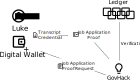

# 21st Century Identity, Privacy and Data Management

A Digital identity revolution is coming. Self-Sovereign Identity (SSI) is a complete inversion of current identity management, giving granular control of personal data to the user. This has exciting and broad ramifications for user privacy, data collection and data transfer. How can governments and organisations  both facilitate and make use of this new model of identity and user privacy?

This document is broken down into chapters.
- Chapter one explains digital identities and how they have evolved over time.
- Chapter two explores current issues with identity and personal data management. 
- Chapter three investigates current Self-Sovereign Identity software solutions and initiatives.
- Chapter four looks at government datasets and data flows and how they could be implemented through a SSI framework.
- Chapter five summarises the findings.

# Chapter One: The Evolution of Identity

## 1.1 What is a Digital Identity? What is Trust?

Wikipedia defines Digital Identity as "A digital identity is information on an entity used by computer systems to represent an external agent. That agent may be a person, organization, application, or device." 

## 1.2 The History Of Digital Identity

Christopher Allen is co-chair of the W3C Credentials Community Group which is working on standards for decentralised identity. Christopher is a pioneer in internet cryptography and worked with Netscape to develop the SSL security protocol and co-author of the IETF TLS internet draft which was used as the heart of all secure commerce of the World World Web. Christopher breaks down identity management into four stages.

### 1.2.1 Centralised / Traditional (Siloed) Identity

This identity model is the traditional form of identity management and the most common. Each organisation / website provides a digital credential for you to use their service.

Trust between the user and the provider is established through the transfer of *shared secrets*, most commonly in the form of a username/password but has expanded out over time into SSH-keys, physical RFID tokens and biometrics. This is known as a siloed system as there is no sharing of data between different organisations - each organisation has a separate and unique credential. 

### 1.2.2 Federated / Third Party Identity

This expands on the centralised identity by providing an identity provider which sits between you and other organisations/services. The identity provider issues the digital credential and acts very similarly to the organisation in the centralised identity model. The identity provider than provides a *single sign-on* experience (usually via a security token) to all organisations that support this identity provider. The major advantage of this model is that it reduces the number of credentials required to be maintained by the user. 

### 1.2.3 User-Centric Identity

This ground-work for this type of identity originated in the white-paper "The Augmented Social Network: Building Identity and Trust into the Next-Generation Internet". The main idea being that "Every Individual ought to have the write to control his or her own identity". A simplified idealised workflow of this identity management:
- A user attempts to use a service and the services queries for identity
- The user then authenticates with a trusted identity provider and asks a for a signed identity letter from the provider stating who the user is. The user then sends this letter to the organisation. If the user cannot authenticate, the provider will return a failure. 
- The service then reads the signed letter and decides to trust the user based on the trust that the service has in the original identity provider. If the user cannot produce a certified letter, the service will prevent use or access. 

This identity management is seen in technologies such as OpenID, OAuth and Facebook Connect. 

### 1.2.4 Self-Sovereign Identity 

Drummond Reed at Evernym defines SSI as a “lifetime portable identity for any person, organisation, or thing that does not depend on any centralised authority and can never be taken away". Self-Sovereign Identity expands upon User-Centric Identity idea - placing the user directly in control of their own credentials in a digital wallet. 

**Issuers** can provide credentials that can be placed in the wallet. These credentials can then be broken up into sub-parts and sent to **organisations**. Organisations can then verify these credentials independently by querying the blockchain. 

#### 1.2.4.1 Self-Sovereign Example: 

A user wishes to enter a bar which requires the user to be over the age of 18. The user gets the government (issuer) to provide a driver's licence credential to the user. The user can break this credential into sub parts such as name, date of birth and address. This data can also be transformed, such as turning the date of birth into "user is over 18" flag. The user then shows this and only this flag to the bar (organisation). The bar can then verify that flag is valid by checking the relevant cryptographic information on the blockchain. Once verified, the user is now allowed into the bar. No additional private information is provided to the organisation. 

The specific workings of this technology will be expanded in the following sections. 

### 1.2.5 Chapter References: 

Christopher Allen, 2016. "[The Path to Self-Sovereign Identity](http://www.lifewithalacrity.com/2016/04/the-path-to-self-soverereign-identity.html)"

Timothy Ruff, 2018 "[The Three Models of Digital Identity Relationships](https://medium.com/evernym/the-three-models-of-digital-identity-relationships-ca0727cb5186)"

Marcos Allende Lopez, 2020. Inter-American Development Bank. "[Self-Sovereign Identity - The future of Identity: Self-Sovereignity, Digital Wallets, and Blockchain](https://publications.iadb.org/publications/english/document/Self-Sovereign-Identity-The-Future-of-Identity-Self-Sovereignity-Digital-Wallets-and-Blockchain.pdf)"

Wikipedia contributors. (2021, August 1). Single sign-on. Wikipedia, The Free Encyclopedia. Retrieved 11:28, August 21, 2021. "[Single Sign-on](https://en.wikipedia.org/w/index.php?title=Single_sign-on&oldid=1036527960)"

Jordon, Ken, Jan Hauser, and Steven Foster. 2003. [“The Augmented Social Network: Building Identity and Trust into the Next-Generation Internet”](http://asn.planetwork.net/asn-archive/AugmentedSocialNetwork.pdf)

John Phillips. Interview. 2018. Australian Payments Summit. "[Self Sovereign Identity](https://www.auspaynet.com.au/insights/Blog/Self-Sovereign-Identity)"

# Chapter Two: Issues and Risks with the Identity Frameworks

## 2.1 Concerns with Traditional Identity Frameworks

### 2.1.1 Data Silos
Large Centralised Identity providers have access to millions of digital identities which makes them a target. (For example Yahoo and Equifax Data Breaches.)

### 2.1.2 Lack Of Transparency 
How is user data being used? (Is it marketing? Political Analysis?).  Is it being transferred to additional third parties?  (Facebook–Cambridge Analytica data scandal)

### 2.1.3 Re-Identification of other Data Sets
By cross-referencing information contained in their databases, centralised providers may be able to reidentify existing public datasets. 

In fact the government has been using CSIRO Data61's Personal Information Factor(PIF) tool to analyse all publicly provided datasets risk of de-identification and apply appropriate levels of protection before the data is released.

References:

CSIRO Data61. "[A framework for data de-identification](https://data61.csiro.au/en/Our-Research/Our-Work/Safety-and-Security/Privacy-Preservation/De-identification-Decision-Making-Framework)

Alison Donnellan. CSIRO Data61. "[This new data privacy tool is ensuring anonymous COVID-19 data stays secure and private](https://algorithm.data61.csiro.au/this-new-data-privacy-tool-is-ensuring-anonymous-covid-19-data-stays-secure-and-private/)"

## 2.2 Key-Loss Concerns with Self-Sovereign Identity Frameworks

There are some concerns with the self-sovereign identity with regards to loss of keys or digital for a person's identity. If the person loses access to their wallet, then all stored credentials become inaccessible. However there exist solutions to mitigate this risk:

### 2.2.1 Centralised Key Management Systems

Cloud Storage or automatic offline-backups could be used to host back-up key repositories that can be used to back-up keys and credentials.  This could be inbuilt into the wallet software itself, however wallet providers must provide clear rules on how keys can be retrieved and what mechanisms are in place for data security. Online cloud storage faces much of the same risks as a traditional identity framework. 

### 2.2.2 Decentralised Key Management System

A private key can be broken up into a number of parts using a Shamir Secret Sharing Protocol. For example: If the user splits their key into 10 pieces and gives them to their family and friends, then they can reproduce their secret key by retreiving combining at least 5 of these pieces. Again this could integrated into the wallet software.

# Chapter Three: Current Software Solutions and Initiatives

## 3.1 Sovrin, Evernym and Hyperledger Indy

Sovrin is currently the leading open-source self-sovereign identity public ledger. It markets itself as _"public permissioned"_ distributed ledger design. Whereby anyone can use the Sovereign network for credential management, only trusted individuals or organisations can provide credentials. An analogy they use is that it similar to the global ATM network - any user can use a provided ATM but only those who have permission can add a new ATM to the network. This is very different to _"permissionless"_ ledgers such as Bitcoin and Etherum where anyone can join the network. No mining is required for permission based ledgers, as trust is provided by the foundation's verification and attackers cannot perform a 51% attack to control the ledger.  Further information about the organisation can be found in Sovrin's white paper "[The Inevitable Rise of Self-Sovereign Identity](https://sovrin.org/wp-content/uploads/2018/03/The-Inevitable-Rise-of-Self-Sovereign-Identity.pdf)".

Sovrin's main ledger was originally operated by a company called Evernym before entrusting it to the Sovrin Foundation. Evernym realised that a public open-access foundation was better suited to original ideas of self-sovereign identity rather than a private ledger company. Evernym also understood that developers were key to improving and driving adoption of public ledger technologies and open-sourced all ledger source code in the Hyperledger Indy project.

Hyperledger Indy is an open-source ledger technology that can be deployed individually or by organisations who wish to run their own self-sovereign identity management ledgers. 

The Sovrin Network - "[Sovrin Foundation](https://sovrin.org)"

HyperLedger Indy - Distributed Ledger Software "[HyperLedger Indy](https://www.hyperledger.org/use/hyperledger-indy)"

## 3.2 ESSIF - European Self Sovereign Identity Framework

The European Self-Sovereign Identity Framework Lab is an EU-funded project looking to advance the broad uptake of Self-Sovereign Identities. They are offering **5.6 million euros** across 62 projects.

"[European Self Sovereign Identity Framework](https://essif-lab.eu/)"

# Chapter Four: Dataset Case Studies - A Glimpse at the Future

## 4.1 Re-imagining Employment

### 4.1.1 A sovereign workflow

*Author's Note: This example uses the tutorial provided by the HyperLedger Indy Project as a foundation before expanding it out to include further government employment outcomes.*

**Luke**, an aspiring software engineer has just graduated from **Programming University**. He wishes to apply to all relevant jobs that fit his skill-sets. Can a Self-Sovereign Identity framework help him?

Luke begins by creating a **digital wallet** which will be used to store his credentials and cryptographic data. This wallet has a *link secret* which will be used to guarantee that all **credentials** stored in the wallet are *uniquely identifiable* as Luke's. This functionality will provided by an application on Luke's phone.

As in real life, the usefulness and reliability of a credential is tied directly to the reputation of the issuer of the credential. While it would be fun to create a driver's licence with a graphics editor and a household printer, no-one would take it seriously in real life. Similarly in self-sovereign identity, it would be fine for Luke to create a name or phone number credential in his wallet, but it would be less impressive to create an academic transcript without proof. 

To improve Luke's chances of getting a job, we must request a **"Transcript"** credential from Programming University. Luke first wonders what information is contained in the **Transcript**. Thankfully for an **issuer** to provide a **credential**, there must be an associated **schema** written to the **verification ledger**. Luke uses the app to query the ledger and finds that the **Programming University** provides the following information *"firstName", "lastName", "degree", "status", "year", "academicAverage"* in its **Transcript** credential - perfect for future job applications. It is important to note this in this example that Luke had already previous verified to the university of his name, date of birth, email address in a traditional physical process. The university already *knows* who Luke is and has provided a unique way (most likely via a link in email) for him to download his transcript. In the future, perhaps Luke can provide his government ID as a credential directly to the university. Luke then downloads this credential into his wallet. 

Luke then finds that **"GovHack"** is hiring for a beginning software position. Luke accesses the **GovHack** application page which prompts Luke for a job application **proof**. This proof requests the following information:
- Attributes:  *"firstName", "lastName", "phoneNumber", "degree", "status"*.
- Predicate: *"academicAverage > 70"*
- Restrictions: *"degree", "status", "academicAverage"* require **Programming University** verification

This proof explores a few concepts crucial to the sovereign identity model. Firstly, only some of the attributes are required to be verified. This allows Luke to fill in his first and last names and phone number (by providing his own credentials), however all of the remaining data must be verified. Secondly, the proof requires a predicate or condition of a high academic average, but not necessarily a distinct value. Thirdly, there is no reason for all satisfying information to come from one credential - a user can mix and match credentials from different sources as long as they satisfy the restrictions listed in the proof request. 

Luke's phone application now automatically prefills all this data from his previously downloaded transcript credential and fills in the phone number field as it doesn't currently exist. He clicks the submit button and GovHack receives a complete job application, including already-verified information containing his academic average and degree. Behind the scenes, GovHack's own system queries the ledger and ensures that the transcript credential is provided by the trusted Programming University. Luke can also track inside his phone application all private data that he has provided in the past. 

It is important to note that *no personal information* is stored on the ledger itself. The ledger is a public record, filled with psudeoanonymous data and verifiable identifiers but all transfer of data is done directly between parties. Verification of credentials can be down without generating a transaction on the chain which guarantees that there is no traceability of verification. 

References: 
https://github.com/hyperledger/indy-sdk/blob/master/docs/getting-started/indy-walkthrough.md

### 4.1.2 Exploring the Data Skills Dataset

Consider now the impact that having instantly verifiable chains of credentials can have. Government and other organisations (such as Engineers Australia) already provide certification of various educational institutions. As part of this certification, they could also grant particular institutions the ability to include various taught skill-sets/specialist tasks on their digital academic transcripts. When the user downloads their transcripts, an additional credential is now automatically downloaded and filled with all relevant skills. Potential employers could then specify required specific specialist tasks on their job application proofs to ensure they get the right candidates. Candidates could self-verify a particular skill if needed and verification could be performed in a traditional interview. However employers could prefer candidates with their skill-set is accredited by the an educational organisation. Employers could also verify skill-sets for their employees as they learn on the job, smoothing out the "getting a reference" issue or improving the apprentice-ship system. 

By turning the Australia Skills Classification into an automatic system which can be viewed and processed in your digital wallet, it would remove a lot of friction between changing careers or determining the value of an additional qualification. 

Dataset: [Australian Skills Classification data](https://www.nationalskillscommission.gov.au/our-work/australian-skills-classification)

## 4.2 Covid-19 

The current check-in system relies on the user scanning the QR code on entry. The user's name and phone-number are then uploaded to an unknown system. The user then relies on the government taking proper data security precautions with the invaluable location data and also preventing it from being accessed by third parties or even other departments. There has been issues where police have requested access to use this health data for investigations. 

Let's now imagine how this system could be implemented when a self-sovereign identity system. In a basic naive implementation, it would work almost identically to how it does now. Your phone would pull up your identity credentials (such a one provided by your driver's license) and automatically fill in the store login proof request and send that proof to the current QR tracking system. 

However we could implement a system whereby our location data is not transmitted. When the user checks in via QR code, we are now provided a verified credential listing the time and date of the check-in and a unique location identifier and we store that in the digital wallet. This credential can be used within the application to provide proof of check-in. A signed anonymous identifier could be transferred to the government for aggregate data collection. Now let's examine what would happen in the event of an outbreak:

Data.Vic's "Victorian SARS-CoV-2 (COVID-19) current exposure sites" uses the following metadata headers:

- Suburb
- Site_title
- Site_streetaddress
- Site_state
- Site_postcode
- Exposure_date_dtm 
- Exposure_date 
- Exposure_time 
- Notes
- Added_date_dtm
- Added_date
- Added_time
- Advice_title
- Advice_instruction 
- Exposure_time_start_24
- Exposure_time_end_24

These can easily be turned into a request for proof against the user's private wallet, by converting the exposure location into predicate (distance < 100m) for instance and matching the (exposure_date/exposure_time) against our check-in time. I expect it is much easier in practice, as the government could formulate a request with a matching unique location identifier for the chosen store. It is important to note it is still up to the user if they then wish to inform the government. All Self-Sovereign identity requests must have **consent** - a fundamental philosophy of the platform. If consent is not given, then no data can be transferred. In practice, this is not much different than providing a fake name or number to the Covid-19 QR sign-in. However in our example, there is one positive - the user is informed that they match the exposure site without them providing any name or number. 

This exposure list site could also be used as a verification step when entering sensitive locations. When entering a hospital at the moment, a list of the current exposure sites is located at the entrance. The person at the desk then asks if you've been to any of these locations recently, and it's up to person to quickly parse all of the locations and work out if they've been to any of them. Instead a request for proof could be quickly compared against the user's digital wallet and it would immediately flag any potential crossover between the user's location data and the exposure sites - again without any unnecessary communication of private information. 

Dataset: [All Victorian SARS-CoV-2 (COVID-19) current exposure sites](https://discover.data.vic.gov.au/dataset/all-victorian-sars-cov-2-covid-19-current-exposure-sites)

## 4.3 Vaccine Passport

The use of a Self-Sovereign Identity system would also perfectly match the use-case of digital vaccine passports. When a user is vaccinated, a digital vaccination record is stored in their wallet. This contains all the relevant information such as type of vaccine, time and date - it can also be verified cryptographically as it provided by a trusted source - the health department. 

When the user wishes to attend an event, airline or a workplace which has a vaccine-requirement as a condition of entry, they can simply scan a QR code at the event, respond to the proof request "Are you fully vaccinated?" and transfer a simple yes or no answer to the establishment. The user provides no medical information to the venue, but the venue/airline/organisation can have trust that the user is vaccinated as the credential is signed. 

References: 
"[Immunity credentials using self-sovereign identity for combating COVID-19 pandemic](https://www.ncbi.nlm.nih.gov/pmc/articles/PMC7983450/)"

# Summary

[1](#identrev)

<a id="identrev">1</a>: This is a footnote.[↩](#a1)